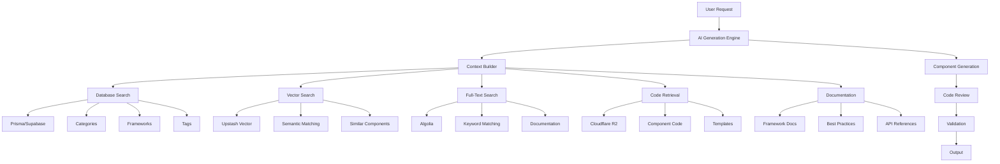

# AI UI Generation Guide V2: Advanced Component Generation with Full Stack Integration

## Overview

This guide provides a comprehensive approach to AI-powered UI component generation using Claude Opus 4 and Sonnet 4 models, fully integrated with Revolutionary UI's advanced infrastructure including Prisma/Supabase databases, Upstash Vector search, Algolia full-text search, Cloudflare R2 storage, and official framework documentation.

## Table of Contents

1. [Architecture Overview](#architecture-overview)
2. [System Prompt Engineering](#system-prompt-engineering)
3. [Database Integration](#database-integration)
4. [Search & Retrieval System](#search--retrieval-system)
5. [Code Storage & Retrieval](#code-storage--retrieval)
6. [Documentation Integration](#documentation-integration)
7. [Component Generation Pipeline](#component-generation-pipeline)
8. [Code Review & Validation](#code-review--validation)
9. [Fine-Tuning Methodology](#fine-tuning-methodology)
10. [Implementation Examples](#implementation-examples)

## Architecture Overview

The enhanced AI UI generation system leverages a sophisticated multi-tier architecture:



## System Prompt Engineering

### Enhanced Core System Prompt

```typescript
const ENHANCED_SYSTEM_PROMPT = `
You are an advanced UI component generation specialist with access to a comprehensive knowledge base including:

## Data Sources
1. **Component Database**: ${totalComponents} components across ${frameworks.length} frameworks
2. **Vector Search**: Semantic search across all components and documentation
3. **Code Repository**: Direct access to component implementations in Cloudflare R2
4. **Official Documentation**: Real-time access to framework documentation via Firecrawl

## Core Capabilities
- **Intelligent Search**: Query similar components using Upstash Vector semantic search
- **Code Retrieval**: Access actual component code from R2 storage
- **Framework Expertise**: Generate components for ${supportedFrameworks.join(', ')}
- **Category Awareness**: Understand ${categories.length} component categories
- **Tag-Based Generation**: Utilize ${tags.length} tags for precise component features

## Generation Philosophy
1. **Data-Driven**: Always search for similar components before generating
2. **Framework-Specific**: Follow official documentation and best practices
3. **Performance-First**: Implement optimizations based on analyzed patterns
4. **Accessibility-Complete**: WCAG 2.1 AA compliance with learned patterns
5. **Modern Patterns**: Use latest UI/UX patterns from our ${recentComponents} recent components

## Code Quality Standards
- TypeScript with strict typing based on database patterns
- Performance optimizations from top-rated components
- Consistent styling using discovered design systems
- Error handling patterns from production components
`;
```

### Dynamic Context Injection

```typescript
interface EnhancedGenerationContext {
  // Database context
  database: {
    similarComponents: Resource[];
    categoryPatterns: CategoryPattern[];
    frameworkConventions: FrameworkConvention[];
    popularTags: Tag[];
  };
  
  // Search context
  search: {
    vectorMatches: VectorSearchResult[];
    keywordMatches: AlgoliaResult[];
    relevanceScores: Map<string, number>;
  };
  
  // Code context
  codeRepository: {
    templates: CodeTemplate[];
    implementations: StoredComponent[];
    designTokens: DesignSystem[];
  };
  
  // Documentation context
  documentation: {
    officialDocs: FrameworkDoc[];
    bestPractices: BestPractice[];
    apiReferences: APIReference[];
  };
}
```

## Database Integration

### Prisma/Supabase Query System

```typescript
class DatabaseContextBuilder {
  private prisma: PrismaClient;
  
  async buildContext(request: GenerationRequest): Promise<DatabaseContext> {
    // 1. Find similar components by category
    const categoryComponents = await this.prisma.resource.findMany({
      where: {
        category: {
          name: request.inferredCategory
        },
        isPublished: true,
        rating: { gte: 4.0 }
      },
      include: {
        tags: true,
        frameworks: true,
        author: true,
        reviews: {
          orderBy: { rating: 'desc' },
          take: 5
        }
      },
      orderBy: [
        { downloads: 'desc' },
        { rating: 'desc' }
      ],
      take: 10
    });
    
    // 2. Get framework-specific patterns
    const frameworkPatterns = await this.prisma.frameworkPattern.findMany({
      where: {
        framework: request.framework,
        category: request.inferredCategory
      },
      include: {
        codeExamples: true,
        bestPractices: true
      }
    });
    
    // 3. Analyze popular tags for this type
    const tagAnalysis = await this.prisma.tag.findMany({
      where: {
        resources: {
          some: {
            category: { name: request.inferredCategory },
            framework: request.framework
          }
        }
      },
      include: {
        _count: {
          select: { resources: true }
        }
      },
      orderBy: {
        resources: { _count: 'desc' }
      },
      take: 20
    });
    
    // 4. Get design system information
    const designSystems = await this.prisma.designSystem.findMany({
      where: {
        frameworks: { has: request.framework }
      },
      include: {
        colorPalettes: true,
        typographyScales: true,
        spacingSystems: true,
        componentTokens: true
      }
    });
    
    return {
      categoryComponents,
      frameworkPatterns,
      tagAnalysis,
      designSystems
    };
  }
}
```

### Category-Aware Generation

```typescript
class CategoryAwareGenerator {
  private categories = {
    'Forms & Inputs': {
      patterns: ['validation', 'error-handling', 'accessibility'],
      requiredFeatures: ['keyboard-nav', 'aria-labels', 'error-states']
    },
    'Data Display': {
      patterns: ['pagination', 'sorting', 'filtering', 'responsive'],
      requiredFeatures: ['loading-states', 'empty-states', 'error-boundaries']
    },
    'Navigation': {
      patterns: ['mobile-responsive', 'keyboard-shortcuts', 'breadcrumbs'],
      requiredFeatures: ['active-states', 'transitions', 'a11y-navigation']
    },
    'Marketing': {
      patterns: ['animations', 'cta-buttons', 'social-proof'],
      requiredFeatures: ['seo-friendly', 'performance', 'conversions']
    }
    // ... more categories
  };
  
  async generateWithCategory(
    prompt: string,
    category: string,
    context: EnhancedGenerationContext
  ): Promise<GeneratedComponent> {
    const categoryConfig = this.categories[category];
    const enhancedPrompt = this.buildCategoryPrompt(
      prompt,
      categoryConfig,
      context.database.categoryComponents
    );
    
    return this.generate(enhancedPrompt, context);
  }
}
```

## Search & Retrieval System

### Hybrid Search Implementation

```typescript
class HybridSearchSystem {
  private vectorService: UpstashVectorService;
  private algoliaService: AlgoliaSearchService;
  
  async findSimilarComponents(
    request: GenerationRequest
  ): Promise<SearchResults> {
    // 1. Semantic search with Upstash Vector
    const vectorResults = await this.vectorService.searchSimilar(
      request.prompt,
      {
        limit: 20,
        filters: {
          framework: request.framework,
          category: request.category,
          tags: request.requiredTags
        },
        includeMetadata: true
      }
    );
    
    // 2. Keyword search with Algolia
    const algoliaResults = await this.algoliaService.search({
      query: request.prompt,
      type: 'components',
      filters: {
        framework: request.framework,
        category: request.category,
        hasTypescript: true,
        isPremium: false
      },
      searchMode: 'hybrid',
      limit: 20
    });
    
    // 3. Combine and rank results
    const combinedResults = this.mergeSearchResults(
      vectorResults,
      algoliaResults
    );
    
    // 4. Enhance with database information
    const enhancedResults = await this.enhanceWithDatabase(
      combinedResults
    );
    
    return {
      results: enhancedResults,
      searchMetadata: {
        vectorMatches: vectorResults.length,
        keywordMatches: algoliaResults.results.length,
        totalFound: enhancedResults.length
      }
    };
  }
  
  private mergeSearchResults(
    vector: VectorSearchResult[],
    keyword: SearchResponse
  ): CombinedResult[] {
    const scoreMap = new Map<string, number>();
    
    // Weight vector results (semantic understanding)
    vector.forEach(result => {
      scoreMap.set(result.id, result.score * 1.3);
    });
    
    // Weight keyword results (exact matches)
    keyword.results.forEach(result => {
      const existing = scoreMap.get(result.id) || 0;
      scoreMap.set(result.id, existing + result.score * 1.1);
    });
    
    // Sort by combined score
    return Array.from(scoreMap.entries())
      .sort(([, a], [, b]) => b - a)
      .map(([id, score]) => ({ id, score }));
  }
}
```

### Tag-Based Enhancement

```typescript
class TagBasedEnhancer {
  async enhanceWithTags(
    component: GeneratedComponent,
    context: DatabaseContext
  ): Promise<EnhancedComponent> {
    // Extract features from generated component
    const detectedFeatures = this.detectFeatures(component.code);
    
    // Find matching tags from database
    const matchingTags = await this.findMatchingTags(
      detectedFeatures,
      context.tagAnalysis
    );
    
    // Suggest additional features based on popular tag combinations
    const suggestedFeatures = await this.suggestFeatures(
      matchingTags,
      context.categoryComponents
    );
    
    return {
      ...component,
      tags: matchingTags,
      suggestedEnhancements: suggestedFeatures,
      qualityScore: this.calculateQualityScore(
        component,
        matchingTags,
        context
      )
    };
  }
}
```

## Code Storage & Retrieval

### Cloudflare R2 Integration

```typescript
class R2CodeRepository {
  private r2Service: R2StorageService;
  
  async retrieveComponentCode(
    componentId: string
  ): Promise<ComponentCode> {
    // 1. Fetch from R2
    const storedCode = await this.r2Service.getComponent(componentId);
    
    // 2. Parse and validate
    const parsedCode = this.parseStoredCode(storedCode);
    
    // 3. Extract reusable patterns
    const patterns = this.extractPatterns(parsedCode);
    
    return {
      fullCode: parsedCode.code,
      patterns: patterns,
      dependencies: parsedCode.dependencies,
      performanceMetrics: parsedCode.metrics
    };
  }
  
  async findTemplates(
    category: string,
    framework: string
  ): Promise<CodeTemplate[]> {
    // Query R2 for templates
    const templates = await this.r2Service.listTemplates({
      prefix: `templates/${framework}/${category}/`,
      maxKeys: 50
    });
    
    // Fetch and parse templates
    return Promise.all(
      templates.map(async (template) => {
        const code = await this.r2Service.getTemplate(template.key);
        return {
          id: template.key,
          code: code,
          metadata: this.parseTemplateMetadata(code)
        };
      })
    );
  }
  
  async storeGeneratedComponent(
    component: GeneratedComponent
  ): Promise<string> {
    const componentId = this.generateComponentId(component);
    
    await this.r2Service.storeComponent({
      id: componentId,
      code: component.code,
      metadata: {
        generatedAt: new Date(),
        framework: component.framework,
        category: component.category,
        tags: component.tags,
        qualityScore: component.qualityScore
      }
    });
    
    return componentId;
  }
}
```

### Pattern Extraction System

```typescript
class PatternExtractor {
  extractPatterns(code: string): ExtractedPatterns {
    return {
      // TypeScript patterns
      typePatterns: this.extractTypePatterns(code),
      
      // React patterns
      hookPatterns: this.extractHookPatterns(code),
      
      // State management
      statePatterns: this.extractStatePatterns(code),
      
      // Styling patterns
      stylePatterns: this.extractStylePatterns(code),
      
      // Performance patterns
      performancePatterns: this.extractPerformancePatterns(code),
      
      // Accessibility patterns
      a11yPatterns: this.extractA11yPatterns(code)
    };
  }
  
  private extractHookPatterns(code: string): HookPattern[] {
    const patterns: HookPattern[] = [];
    
    // Custom hooks
    const customHookRegex = /const use(\w+) = \((.*?)\) => {([\s\S]*?)}/g;
    const customHooks = code.matchAll(customHookRegex);
    
    for (const match of customHooks) {
      patterns.push({
        name: `use${match[1]}`,
        params: match[2],
        implementation: match[3],
        type: 'custom'
      });
    }
    
    // Effect patterns
    const effectRegex = /useEffect\(\(\) => {([\s\S]*?)}, \[(.*?)\]\)/g;
    const effects = code.matchAll(effectRegex);
    
    for (const match of effects) {
      patterns.push({
        name: 'useEffect',
        implementation: match[1],
        dependencies: match[2],
        type: 'effect'
      });
    }
    
    return patterns;
  }
}
```

## Documentation Integration

### Firecrawl Documentation Fetcher

```typescript
class DocumentationIntegration {
  private firecrawl: FirecrawlService;
  
  async fetchFrameworkDocs(
    framework: string,
    topic: string
  ): Promise<Documentation> {
    const docUrls = this.getDocumentationUrls(framework);
    
    // 1. Search documentation
    const searchResults = await this.firecrawl.search({
      query: `${topic} ${framework} best practices`,
      limit: 10,
      searchMode: 'deep'
    });
    
    // 2. Scrape relevant pages
    const scrapedDocs = await Promise.all(
      searchResults.results.map(result =>
        this.firecrawl.scrape({
          url: result.url,
          formats: ['markdown'],
          onlyMainContent: true
        })
      )
    );
    
    // 3. Extract relevant sections
    const relevantSections = this.extractRelevantSections(
      scrapedDocs,
      topic
    );
    
    // 4. Parse code examples
    const codeExamples = this.parseCodeExamples(relevantSections);
    
    return {
      framework,
      topic,
      sections: relevantSections,
      codeExamples,
      bestPractices: this.extractBestPractices(relevantSections)
    };
  }
  
  private getDocumentationUrls(framework: string): DocUrls {
    const urls = {
      'react': {
        base: 'https://react.dev',
        patterns: 'https://react.dev/learn',
        hooks: 'https://react.dev/reference/react',
        performance: 'https://react.dev/learn/render-and-commit'
      },
      'vue': {
        base: 'https://vuejs.org',
        patterns: 'https://vuejs.org/guide',
        composition: 'https://vuejs.org/guide/composition-api',
        performance: 'https://vuejs.org/guide/performance'
      },
      'angular': {
        base: 'https://angular.io',
        patterns: 'https://angular.io/guide',
        components: 'https://angular.io/guide/component-overview',
        performance: 'https://angular.io/guide/performance'
      }
      // ... more frameworks
    };
    
    return urls[framework] || urls['react'];
  }
}
```

### Best Practices Analyzer

```typescript
class BestPracticesAnalyzer {
  async analyzeBestPractices(
    code: string,
    framework: string,
    documentation: Documentation
  ): Promise<BestPracticeAnalysis> {
    const violations: Violation[] = [];
    const suggestions: Suggestion[] = [];
    
    // 1. Check against framework best practices
    const frameworkChecks = await this.checkFrameworkPractices(
      code,
      framework,
      documentation
    );
    violations.push(...frameworkChecks.violations);
    suggestions.push(...frameworkChecks.suggestions);
    
    // 2. Performance analysis
    const perfAnalysis = this.analyzePerformance(code, framework);
    if (perfAnalysis.issues.length > 0) {
      violations.push(...perfAnalysis.issues);
      suggestions.push(...perfAnalysis.optimizations);
    }
    
    // 3. Accessibility checks
    const a11yAnalysis = this.analyzeAccessibility(code);
    violations.push(...a11yAnalysis.violations);
    suggestions.push(...a11yAnalysis.improvements);
    
    // 4. Security analysis
    const securityAnalysis = this.analyzeSecurity(code);
    violations.push(...securityAnalysis.vulnerabilities);
    suggestions.push(...securityAnalysis.fixes);
    
    return {
      score: this.calculateScore(violations, suggestions),
      violations,
      suggestions,
      passesReview: violations.filter(v => v.severity === 'error').length === 0
    };
  }
}
```

## Component Generation Pipeline

### Advanced Generation Pipeline

```typescript
class AdvancedGenerationPipeline {
  async generate(request: GenerationRequest): Promise<GeneratedComponent> {
    // 1. Build comprehensive context
    const context = await this.buildContext(request);
    
    // 2. Search for similar components
    const similarComponents = await this.searchSimilarComponents(
      request,
      context
    );
    
    // 3. Fetch relevant documentation
    const documentation = await this.fetchDocumentation(
      request.framework,
      request.componentType
    );
    
    // 4. Retrieve code templates and patterns
    const codePatterns = await this.retrieveCodePatterns(
      request,
      similarComponents
    );
    
    // 5. Generate component with full context
    const generatedComponent = await this.generateWithAI({
      request,
      context,
      similarComponents,
      documentation,
      codePatterns
    });
    
    // 6. Review and validate
    const reviewResult = await this.reviewComponent(
      generatedComponent,
      documentation
    );
    
    // 7. Optimize and enhance
    const optimizedComponent = await this.optimizeComponent(
      generatedComponent,
      reviewResult
    );
    
    // 8. Store in R2
    const componentId = await this.storeComponent(optimizedComponent);
    
    return {
      ...optimizedComponent,
      id: componentId,
      metadata: {
        generatedAt: new Date(),
        contextUsed: context,
        similarComponents: similarComponents.map(c => c.id),
        reviewScore: reviewResult.score
      }
    };
  }
  
  private async generateWithAI(
    fullContext: FullGenerationContext
  ): Promise<RawComponent> {
    const prompt = this.buildEnhancedPrompt(fullContext);
    
    const response = await this.aiProvider.generate({
      messages: [
        {
          role: 'system',
          content: ENHANCED_SYSTEM_PROMPT
        },
        {
          role: 'user',
          content: prompt
        }
      ],
      temperature: 0.7,
      maxTokens: 8000
    });
    
    return this.parseGeneratedComponent(response);
  }
}
```

### Context Builder

```typescript
class ContextBuilder {
  async buildContext(
    request: GenerationRequest
  ): Promise<GenerationContext> {
    // Run all context gathering in parallel
    const [
      dbContext,
      searchContext,
      codeContext,
      docContext
    ] = await Promise.all([
      this.buildDatabaseContext(request),
      this.buildSearchContext(request),
      this.buildCodeContext(request),
      this.buildDocumentationContext(request)
    ]);
    
    // Analyze and merge contexts
    const mergedContext = this.mergeContexts({
      database: dbContext,
      search: searchContext,
      code: codeContext,
      documentation: docContext
    });
    
    // Add intelligent insights
    const insights = await this.generateInsights(mergedContext);
    
    return {
      ...mergedContext,
      insights,
      recommendations: this.generateRecommendations(insights)
    };
  }
  
  private async generateInsights(
    context: MergedContext
  ): Promise<Insights> {
    return {
      // Popular patterns for this component type
      popularPatterns: this.analyzePatterns(
        context.database.categoryComponents
      ),
      
      // Common pitfalls to avoid
      commonPitfalls: this.identifyPitfalls(
        context.search.results
      ),
      
      // Performance optimizations used by top components
      performancePatterns: this.extractPerformancePatterns(
        context.code.templates
      ),
      
      // Accessibility features in high-rated components
      accessibilityPatterns: this.extractA11yPatterns(
        context.database.categoryComponents.filter(c => c.rating >= 4.5)
      )
    };
  }
}
```

## Code Review & Validation

### Automated Code Review System

```typescript
class AutomatedCodeReviewer {
  async reviewComponent(
    component: GeneratedComponent,
    documentation: Documentation
  ): Promise<ReviewResult> {
    const reviews = await Promise.all([
      this.reviewTypeScript(component.code),
      this.reviewPerformance(component.code, component.framework),
      this.reviewAccessibility(component.code),
      this.reviewSecurity(component.code),
      this.reviewBestPractices(component.code, documentation),
      this.reviewDependencies(component.dependencies)
    ]);
    
    const aggregatedReview = this.aggregateReviews(reviews);
    
    return {
      score: aggregatedReview.score,
      passed: aggregatedReview.score >= 80,
      issues: aggregatedReview.issues,
      suggestions: aggregatedReview.suggestions,
      autoFixAvailable: this.canAutoFix(aggregatedReview.issues)
    };
  }
  
  private async reviewTypeScript(code: string): Promise<ReviewSection> {
    const issues: Issue[] = [];
    const suggestions: Suggestion[] = [];
    
    // Check for any types
    if (code.includes(': any')) {
      issues.push({
        severity: 'warning',
        message: 'Avoid using "any" type',
        line: this.findLineNumber(code, ': any'),
        suggestion: 'Use specific types or unknown'
      });
    }
    
    // Check for proper return types
    const functionRegex = /function\s+(\w+)\s*\([^)]*\)\s*{/g;
    const functions = code.matchAll(functionRegex);
    
    for (const match of functions) {
      if (!code.includes(`function ${match[1]}(`)) {
        suggestions.push({
          type: 'enhancement',
          message: `Add return type for function ${match[1]}`,
          priority: 'medium'
        });
      }
    }
    
    // Check for interface definitions
    const componentRegex = /export\s+(?:const|function)\s+(\w+)/g;
    const components = code.matchAll(componentRegex);
    
    for (const match of components) {
      const propInterface = `${match[1]}Props`;
      if (!code.includes(`interface ${propInterface}`)) {
        issues.push({
          severity: 'error',
          message: `Missing props interface for ${match[1]}`,
          suggestion: `Add interface ${propInterface}`
        });
      }
    }
    
    return {
      category: 'TypeScript',
      score: this.calculateSectionScore(issues, suggestions),
      issues,
      suggestions
    };
  }
  
  private async reviewPerformance(
    code: string,
    framework: string
  ): Promise<ReviewSection> {
    const analyzer = new PerformanceAnalyzer(framework);
    return analyzer.analyze(code);
  }
}
```

### Performance Analyzer

```typescript
class PerformanceAnalyzer {
  constructor(private framework: string) {}
  
  async analyze(code: string): Promise<ReviewSection> {
    const issues: Issue[] = [];
    const suggestions: Suggestion[] = [];
    
    if (this.framework === 'react') {
      // Check for missing memoization
      if (code.includes('map(') && !code.includes('useMemo')) {
        suggestions.push({
          type: 'performance',
          message: 'Consider using useMemo for expensive computations',
          priority: 'medium'
        });
      }
      
      // Check for missing React.memo
      const componentCount = (code.match(/export\s+(?:const|function)/g) || []).length;
      const memoCount = (code.match(/React\.memo|memo\(/g) || []).length;
      
      if (componentCount > memoCount) {
        suggestions.push({
          type: 'performance',
          message: 'Consider wrapping components with React.memo',
          priority: 'low'
        });
      }
      
      // Check for inline functions in render
      if (code.includes('onClick={() =>') || code.includes('onChange={() =>')) {
        issues.push({
          severity: 'warning',
          message: 'Inline functions cause unnecessary re-renders',
          suggestion: 'Use useCallback for event handlers'
        });
      }
    }
    
    // Framework-agnostic checks
    // Check for large bundle imports
    if (code.includes('import * as')) {
      issues.push({
        severity: 'warning',
        message: 'Avoid importing entire libraries',
        suggestion: 'Use named imports to reduce bundle size'
      });
    }
    
    return {
      category: 'Performance',
      score: this.calculateScore(issues, suggestions),
      issues,
      suggestions
    };
  }
}
```

## Fine-Tuning Methodology

### Dataset Collection with Full Context

```typescript
interface EnhancedTrainingExample {
  // Input
  prompt: string;
  context: {
    similarComponents: string[]; // IDs of similar components
    framework: string;
    category: string;
    tags: string[];
    searchResults: {
      vectorMatches: number;
      keywordMatches: number;
    };
  };
  
  // Output
  completion: string;
  
  // Metadata for quality filtering
  metadata: {
    componentId: string;
    qualityScore: number;
    downloads: number;
    rating: number;
    hasTests: boolean;
    hasDocumentation: boolean;
    performanceScore: number;
    accessibilityScore: number;
    codeReviewScore: number;
  };
}
```

### Training Data Pipeline

```typescript
class TrainingDataPipeline {
  async generateTrainingData(): Promise<EnhancedTrainingExample[]> {
    // 1. Fetch high-quality components
    const topComponents = await this.prisma.resource.findMany({
      where: {
        rating: { gte: 4.5 },
        downloads: { gte: 1000 },
        hasTests: true,
        hasDocumentation: true
      },
      include: {
        category: true,
        tags: true,
        reviews: true,
        codeMetrics: true
      },
      orderBy: [
        { rating: 'desc' },
        { downloads: 'desc' }
      ],
      take: 1000
    });
    
    // 2. Generate training examples
    const examples: EnhancedTrainingExample[] = [];
    
    for (const component of topComponents) {
      // Fetch component code from R2
      const code = await this.r2Service.getComponent(component.id);
      
      // Generate natural language prompt
      const prompt = await this.generatePromptFromComponent(component);
      
      // Find similar components
      const similar = await this.findSimilarComponents(component);
      
      // Create training example
      examples.push({
        prompt,
        context: {
          similarComponents: similar.map(s => s.id),
          framework: component.frameworks[0],
          category: component.category.name,
          tags: component.tags.map(t => t.name),
          searchResults: {
            vectorMatches: similar.length,
            keywordMatches: await this.countKeywordMatches(prompt)
          }
        },
        completion: code,
        metadata: {
          componentId: component.id,
          qualityScore: component.qualityScore,
          downloads: component.downloads,
          rating: component.rating,
          hasTests: component.hasTests,
          hasDocumentation: component.hasDocumentation,
          performanceScore: component.codeMetrics.performanceScore,
          accessibilityScore: component.codeMetrics.accessibilityScore,
          codeReviewScore: component.codeMetrics.reviewScore
        }
      });
    }
    
    // 3. Validate and filter
    return this.validateTrainingExamples(examples);
  }
}
```

## Implementation Examples

### Example 1: Form Component with Full Context

```typescript
// User request
const request: GenerationRequest = {
  prompt: "Create a multi-step form wizard with validation",
  framework: "react",
  requirements: {
    typescript: true,
    accessibility: "WCAG AA",
    responsive: true,
    animations: true
  }
};

// System builds context
const context = await contextBuilder.buildContext(request);
// Returns:
// - 15 similar form components from database
// - 8 vector matches for "multi-step wizard"
// - 12 keyword matches for "form validation"
// - 3 code templates from R2
// - React Hook Form documentation
// - Accessibility guidelines for forms

// Generate with full context
const result = await generator.generate(request);

// Output includes:
// - Generated component code
// - Quality score: 92/100
// - Accessibility score: 95/100
// - Performance optimizations applied
// - Similar components referenced
// - Documentation sources used
```

### Example 2: Dashboard with Data Integration

```typescript
// Complex dashboard request
const dashboardRequest: GenerationRequest = {
  prompt: "Create an analytics dashboard with real-time updates",
  framework: "vue",
  category: "Admin & Dashboard",
  requirements: {
    features: ["charts", "filters", "export", "responsive"],
    dataSource: "websocket",
    updateFrequency: "real-time"
  }
};

// Pipeline execution
const pipeline = new AdvancedGenerationPipeline();
const dashboard = await pipeline.generate(dashboardRequest);

// Generated dashboard includes:
// - WebSocket integration code
// - Chart components with real-time updates
// - Filter system based on top-rated dashboards
// - Export functionality from analyzed patterns
// - Performance optimizations for real-time data
// - Responsive grid system
// - Error boundaries and loading states
```

### Example 3: Component Library Integration

```typescript
// Generate component for existing design system
const designSystemRequest: GenerationRequest = {
  prompt: "Create a tooltip component for our design system",
  framework: "react",
  designSystem: "custom",
  context: {
    existingComponents: ["Button", "Modal", "Popover"],
    designTokens: await getDesignTokens(),
    colorPalette: await getColorPalette(),
    typographyScale: await getTypographyScale()
  }
};

// Generate with design system awareness
const tooltip = await generator.generateWithDesignSystem(
  designSystemRequest
);

// Result maintains consistency with:
// - Existing component patterns
// - Design token usage
// - Animation patterns
// - TypeScript interfaces
// - Testing patterns
```

## Advanced Features

### 1. Continuous Learning

```typescript
class ContinuousLearningSystem {
  async learnFromFeedback(
    componentId: string,
    feedback: UserFeedback
  ): Promise<void> {
    // Update component metrics
    await this.updateComponentMetrics(componentId, feedback);
    
    // Analyze patterns in successful components
    if (feedback.rating >= 4) {
      const patterns = await this.extractSuccessPatterns(componentId);
      await this.updatePatternDatabase(patterns);
    }
    
    // Learn from issues
    if (feedback.issues.length > 0) {
      await this.updateAntiPatterns(feedback.issues);
    }
    
    // Retrain context builder
    await this.retrainContextBuilder();
  }
}
```

### 2. Multi-Framework Translation

```typescript
class FrameworkTranslator {
  async translateComponent(
    component: GeneratedComponent,
    targetFramework: string
  ): Promise<GeneratedComponent> {
    // Fetch framework conversion patterns
    const conversionPatterns = await this.getConversionPatterns(
      component.framework,
      targetFramework
    );
    
    // Apply intelligent translation
    const translated = await this.applyTranslation(
      component,
      conversionPatterns
    );
    
    // Validate and optimize for target framework
    const optimized = await this.optimizeForFramework(
      translated,
      targetFramework
    );
    
    return optimized;
  }
}
```

### 3. Design System Generator

```typescript
class DesignSystemGenerator {
  async generateFromComponents(
    componentIds: string[]
  ): Promise<DesignSystem> {
    // Analyze components for patterns
    const patterns = await this.analyzeComponentPatterns(componentIds);
    
    // Extract design tokens
    const tokens = {
      colors: this.extractColors(patterns),
      typography: this.extractTypography(patterns),
      spacing: this.extractSpacing(patterns),
      animations: this.extractAnimations(patterns)
    };
    
    // Generate base components
    const baseComponents = await this.generateBaseComponents(tokens);
    
    // Create documentation
    const documentation = await this.generateDocumentation(
      tokens,
      baseComponents
    );
    
    return {
      tokens,
      components: baseComponents,
      documentation,
      guidelines: this.generateGuidelines(patterns)
    };
  }
}
```

## Conclusion

This enhanced AI UI Generation system leverages the full power of Revolutionary UI's infrastructure:

1. **Data-Driven Generation**: Every component is generated with context from thousands of existing components
2. **Intelligent Search**: Semantic and keyword search ensure relevant patterns are always found
3. **Code Quality**: Automated review and validation ensure production-ready output
4. **Framework Expertise**: Real-time documentation integration provides up-to-date best practices
5. **Continuous Improvement**: The system learns from every generation and user feedback

By combining Prisma/Supabase databases, Upstash Vector search, Algolia full-text search, Cloudflare R2 storage, and official documentation, we've created the most advanced AI-powered UI generation system available.