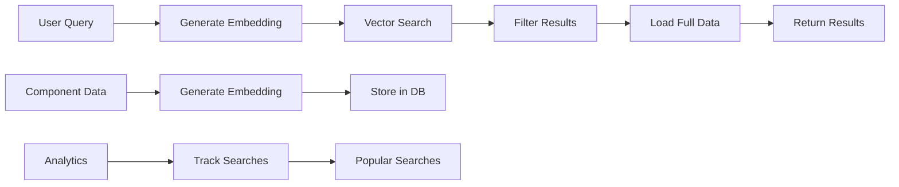

# AI-Powered Semantic Search Documentation

## Overview

The Revolutionary UI Factory System now includes AI-powered semantic search using OpenAI embeddings and PostgreSQL pgvector. This enables natural language search queries to find components based on meaning rather than just keyword matching.

## Features

- **Natural Language Search**: Find components using descriptions like "responsive data table with sorting"
- **Semantic Understanding**: Understands context and meaning, not just keywords
- **Similar Component Discovery**: Automatically suggests similar components
- **Filtered Search**: Combine semantic search with framework, category, and tag filters
- **Search Analytics**: Track popular searches and user behavior
- **Fast Performance**: Uses HNSW indexing for millisecond response times

## Architecture

### Technology Stack

- **OpenAI text-embedding-ada-002**: Generates 1536-dimensional embeddings
- **PostgreSQL pgvector**: Stores and queries vector embeddings
- **HNSW Indexing**: Hierarchical Navigable Small World for fast similarity search
- **Cosine Similarity**: Measures semantic distance between vectors

### Data Flow



## Setup Guide

### 1. Enable pgvector Extension

#### For Supabase:
1. Go to your Supabase dashboard
2. Navigate to Database > Extensions
3. Enable the "vector" extension
4. Run the migration:
```bash
npm run setup:vector-search
```

#### For Local PostgreSQL:
```sql
CREATE EXTENSION vector;
```

### 2. Set OpenAI API Key

Add to your `.env.local`:
```env
OPENAI_API_KEY=sk-...
```

### 3. Run Database Migration

```bash
# Using Supabase CLI
supabase migration up

# Or using the SQL file directly
psql $DATABASE_URL < supabase/migrations/20240104000000_add_vector_search.sql
```

### 4. Generate Embeddings

```bash
# Generate embeddings for all resources
npm run embeddings:generate

# Dry run to see what would be done
npm run embeddings:generate:dry

# Force regenerate all embeddings
npm run embeddings:generate -- --force-all

# Custom batch size
npm run embeddings:generate -- --batch=20
```

## API Reference

### Search Endpoint

**POST** `/api/search/semantic`

```typescript
interface SearchRequest {
  query: string;           // Natural language search query
  limit?: number;         // Max results (default: 10, max: 50)
  threshold?: number;     // Similarity threshold 0-1 (default: 0.7)
  filters?: {
    framework?: string;   // Filter by framework
    category?: string;    // Filter by category
    tags?: string[];      // Filter by tags
  };
}

interface SearchResponse {
  query: string;
  results: Array<{
    id: string;
    score: number;        // Similarity score 0-1
    resource: {
      id: string;
      name: string;
      slug: string;
      description: string;
      framework?: string;
      category?: string;
      tags: string[];
      author: {
        name: string;
        image?: string;
      };
      downloads: number;
      reviews: number;
      createdAt: string;
      updatedAt: string;
    };
  }>;
  totalResults: number;
}
```

**Example:**
```bash
curl -X POST http://localhost:3000/api/search/semantic \
  -H "Content-Type: application/json" \
  -d '{
    "query": "responsive data table with sorting and filtering",
    "limit": 5,
    "filters": {
      "framework": "react"
    }
  }'
```

### Similar Components Endpoint

**GET** `/api/resources/{id}/similar`

```typescript
interface SimilarResponse {
  resourceId: string;
  similar: Array<{
    id: string;
    score: number;
    resource: ResourceData;
  }>;
}
```

**Example:**
```bash
curl http://localhost:3000/api/resources/clxyz123/similar?limit=5
```

### Popular Searches Endpoint

**GET** `/api/search/semantic`

```typescript
interface PopularSearchesResponse {
  popularSearches: string[];
}
```

## Frontend Integration

### React Components

#### SemanticSearch Component
```tsx
import { SemanticSearch } from '@/components/search/SemanticSearch';

function SearchPage() {
  return <SemanticSearch />;
}
```

#### SimilarComponents Widget
```tsx
import { SimilarComponents } from '@/components/resource/SimilarComponents';

function ResourcePage({ resourceId }) {
  return (
    <div>
      {/* Resource details */}
      <SimilarComponents resourceId={resourceId} limit={5} />
    </div>
  );
}
```

### Custom Hook Example
```tsx
import { useState, useEffect } from 'react';

function useSemanticSearch(query: string, filters?: SearchFilters) {
  const [results, setResults] = useState([]);
  const [loading, setLoading] = useState(false);

  useEffect(() => {
    if (!query) return;

    setLoading(true);
    fetch('/api/search/semantic', {
      method: 'POST',
      headers: { 'Content-Type': 'application/json' },
      body: JSON.stringify({ query, filters }),
    })
      .then(res => res.json())
      .then(data => setResults(data.results))
      .finally(() => setLoading(false));
  }, [query, filters]);

  return { results, loading };
}
```

## Search Quality Optimization

### 1. Embedding Content

The quality of search results depends on what content is embedded. We include:
- Component name
- Description
- Framework
- Category
- Tags
- First 500 characters of source code

### 2. Prompt Engineering

For best results, encourage users to:
- Use descriptive queries
- Include context (e.g., "for e-commerce", "with TypeScript")
- Mention specific features needed

### 3. Threshold Tuning

- **0.9+**: Nearly identical components
- **0.7-0.9**: Very similar components (default)
- **0.5-0.7**: Related components
- **<0.5**: Loosely related

### 4. Re-indexing Strategy

```bash
# Run weekly to update embeddings for modified components
0 0 * * 0 cd /app && npm run embeddings:generate
```

## Performance Considerations

### Embedding Generation
- Cost: ~$0.0001 per component
- Time: ~100ms per component
- Rate limit: 3,000 RPM for ada-002

### Search Performance
- Embedding generation: ~200ms
- Vector search: ~50ms
- Total response time: <500ms

### Scaling Guidelines
- Use connection pooling for database
- Cache embedding results
- Consider read replicas for high traffic
- Monitor pgvector index size

## Troubleshooting

### Common Issues

#### 1. "pgvector extension not found"
```sql
-- Check if extension is available
SELECT * FROM pg_available_extensions WHERE name = 'vector';

-- Enable it
CREATE EXTENSION vector;
```

#### 2. "OpenAI API key not found"
```bash
# Check environment variable
echo $OPENAI_API_KEY

# Set it in .env.local
OPENAI_API_KEY=sk-...
```

#### 3. Slow search performance
```sql
-- Check index usage
EXPLAIN (ANALYZE, BUFFERS) 
SELECT * FROM "ResourceEmbedding" 
ORDER BY embedding <=> '[...]'::vector 
LIMIT 10;

-- Rebuild index if needed
REINDEX INDEX "ResourceEmbedding_embedding_idx";
```

#### 4. No search results
```bash
# Check if embeddings exist
npm run embeddings:generate -- --dry-run

# Generate missing embeddings
npm run embeddings:generate
```

## Analytics & Monitoring

### Track Search Performance
```sql
-- Popular searches last 7 days
SELECT query, COUNT(*) as count
FROM "SearchQuery"
WHERE "createdAt" > NOW() - INTERVAL '7 days'
GROUP BY query
ORDER BY count DESC
LIMIT 20;

-- Average search performance
SELECT 
  DATE_TRUNC('day', "createdAt") as day,
  AVG("searchDuration") as avg_duration,
  AVG("resultCount") as avg_results
FROM "SearchQuery"
GROUP BY day
ORDER BY day DESC;
```

### Monitor Embedding Coverage
```sql
-- Components without embeddings
SELECT r.id, r.name
FROM "Resource" r
LEFT JOIN "ResourceEmbedding" re ON r.id = re."resourceId"
WHERE re.id IS NULL;

-- Embedding statistics
SELECT 
  COUNT(DISTINCT r.id) as total_resources,
  COUNT(DISTINCT re."resourceId") as resources_with_embeddings,
  COUNT(DISTINCT re."resourceId")::float / COUNT(DISTINCT r.id) as coverage_percentage
FROM "Resource" r
LEFT JOIN "ResourceEmbedding" re ON r.id = re."resourceId";
```

## Security Considerations

1. **API Key Protection**: Never expose OpenAI API key to frontend
2. **Rate Limiting**: Implement rate limits on search endpoints
3. **Input Validation**: Sanitize and validate search queries
4. **Cost Control**: Monitor OpenAI API usage and costs

## Future Enhancements

1. **Multi-language Support**: Embeddings for different languages
2. **Fine-tuned Models**: Custom embeddings for UI components
3. **Hybrid Search**: Combine vector search with full-text search
4. **Personalization**: User-specific search rankings
5. **Visual Search**: Search by UI screenshots

## Resources

- [OpenAI Embeddings Guide](https://platform.openai.com/docs/guides/embeddings)
- [pgvector Documentation](https://github.com/pgvector/pgvector)
- [Supabase Vector Search](https://supabase.com/docs/guides/ai/vector-embeddings)
- [HNSW Algorithm](https://arxiv.org/abs/1603.09320)