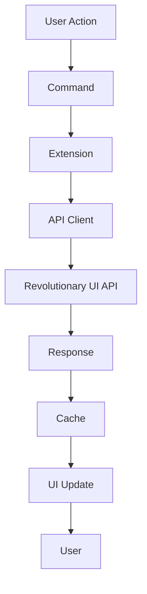

# VS Code Extension Development Guide

## Overview

The Revolutionary UI VS Code Extension provides seamless integration between VS Code and the Revolutionary UI component library. It enables developers to search, preview, and insert components directly from their IDE.

## Architecture

### Core Components

1. **Extension Entry Point** (`src/extension.ts`)
   - Activates the extension
   - Registers commands and providers
   - Manages extension lifecycle

2. **API Client** (`src/api/RevolutionaryUIAPI.ts`)
   - Handles all API communications
   - Manages authentication
   - Provides error handling

3. **Providers**
   - **ComponentSearchProvider**: Quick pick UI for searching
   - **ComponentExplorerProvider**: Tree view for browsing
   - **ComponentProvider**: IntelliSense completions
   - **FavoritesProvider**: Manages favorite components
   - **RecentComponentsProvider**: Tracks recent usage

4. **Services**
   - **ComponentCache**: In-memory caching
   - **AIComponentGenerator**: GPT-4 integration

5. **Panels**
   - **ComponentPreviewPanel**: Webview for previewing

### Data Flow



## Key Features Implementation

### 1. Semantic Search

```typescript
// Search implementation with caching
async searchComponents(query: string): Promise<Component[]> {
    const cacheKey = `search-${query}`;
    const cached = this.cache.get(cacheKey);
    
    if (cached) return cached;
    
    const results = await this.api.searchComponents(query);
    this.cache.set(cacheKey, results, 600); // 10 min cache
    
    return results;
}
```

### 2. IntelliSense Integration

```typescript
// Completion provider for JSX/TSX
provideCompletionItems(document, position) {
    const lineText = document.lineAt(position).text;
    const beforeCursor = lineText.substring(0, position.character);
    
    // Only provide completions after '<'
    if (!beforeCursor.match(/<\s*\w*$/)) {
        return [];
    }
    
    // Return component suggestions
    return components.map(c => createCompletionItem(c));
}
```

### 3. Component Insertion

```typescript
// Smart insertion based on user preference
async insertComponent(component: Component) {
    const insertMode = config.get('insertMode');
    
    switch (insertMode) {
        case 'inline':
            editor.edit(builder => {
                builder.insert(position, componentCode);
            });
            break;
        case 'newFile':
            const doc = await workspace.openTextDocument({
                content: componentCode,
                language: getLanguageId(component.framework)
            });
            await window.showTextDocument(doc);
            break;
        case 'clipboard':
            await env.clipboard.writeText(componentCode);
            break;
    }
}
```

### 4. AI Generation

```typescript
// Generate component from description
async generateComponent(description: string) {
    const response = await openai.createChatCompletion({
        model: 'gpt-4',
        messages: [
            { role: 'system', content: getSystemPrompt() },
            { role: 'user', content: description }
        ]
    });
    
    return parseAIResponse(response);
}
```

## Extension Commands

| Command | ID | Description |
|---------|-----|-------------|
| Search Components | `revolutionaryUI.searchComponents` | Open semantic search |
| Browse Library | `revolutionaryUI.browseComponents` | Open component browser |
| Insert Component | `revolutionaryUI.insertComponent` | Insert at cursor |
| Generate with AI | `revolutionaryUI.generateComponent` | AI generation |
| Show Preview | `revolutionaryUI.showPreview` | Preview component |
| Open Settings | `revolutionaryUI.openSettings` | Extension settings |

## Configuration Schema

```json
{
  "revolutionaryUI.apiUrl": {
    "type": "string",
    "default": "https://revolutionary-ui.com/api",
    "description": "API endpoint URL"
  },
  "revolutionaryUI.apiKey": {
    "type": "string",
    "default": "",
    "description": "API key for authentication"
  },
  "revolutionaryUI.defaultFramework": {
    "type": "string",
    "enum": ["react", "vue", "angular", "svelte", "vanilla"],
    "default": "react"
  },
  "revolutionaryUI.insertMode": {
    "type": "string",
    "enum": ["inline", "newFile", "clipboard"],
    "default": "inline"
  }
}
```

## Development Workflow

### Setup

```bash
# Clone repository
git clone https://github.com/siliconyouth/revolutionary-ui.git
cd revolutionary-ui/vscode-extension/revolutionary-ui

# Install dependencies
npm install

# Compile TypeScript
npm run compile
```

### Testing

1. Press `F5` to launch Extension Development Host
2. Test all commands and features
3. Check Debug Console for logs
4. Set breakpoints for debugging

### Building

```bash
# Install vsce globally
npm install -g vsce

# Package extension
vsce package

# Publish to marketplace
vsce publish
```

## Best Practices

### 1. Error Handling

Always provide user-friendly error messages:

```typescript
try {
    const result = await api.someMethod();
} catch (error) {
    if (error.code === 'NETWORK_ERROR') {
        vscode.window.showErrorMessage(
            'Network error. Please check your connection.'
        );
    } else {
        vscode.window.showErrorMessage(
            `Error: ${error.message}`
        );
    }
}
```

### 2. Performance

- Use caching to reduce API calls
- Debounce search input
- Lazy load large data sets
- Dispose resources properly

### 3. User Experience

- Provide progress indicators
- Show helpful tooltips
- Remember user preferences
- Offer keyboard shortcuts

### 4. Security

- Never log sensitive data
- Validate all inputs
- Use secure storage for API keys
- Handle authentication errors gracefully

## Testing Guidelines

### Unit Tests

```typescript
describe('ComponentCache', () => {
    it('should cache and retrieve data', () => {
        const cache = new ComponentCache();
        cache.set('key', 'value', 60);
        expect(cache.get('key')).toBe('value');
    });
});
```

### Integration Tests

```typescript
describe('API Integration', () => {
    it('should search components', async () => {
        const api = new RevolutionaryUIAPI();
        const results = await api.searchComponents('button');
        expect(results.length).toBeGreaterThan(0);
    });
});
```

### Manual Testing Checklist

- [ ] Extension activates correctly
- [ ] Search returns relevant results
- [ ] Components insert properly
- [ ] Preview displays correctly
- [ ] Settings update behavior
- [ ] Error states handled
- [ ] Offline functionality
- [ ] Performance acceptable

## Troubleshooting

### Common Issues

1. **Extension not loading**
   - Check package.json activation events
   - Verify no syntax errors in entry point
   - Check Output panel for errors

2. **API connection failures**
   - Verify API URL configuration
   - Check network connectivity
   - Validate API key

3. **IntelliSense not working**
   - Ensure correct file type (JSX/TSX)
   - Check language mode
   - Verify completion provider registration

4. **Webview not displaying**
   - Check Content Security Policy
   - Verify resource URIs
   - Check console for errors

## Publishing

### Pre-publish Checklist

- [ ] Update version in package.json
- [ ] Update CHANGELOG.md
- [ ] Test all features
- [ ] Update README.md
- [ ] Add/update screenshots
- [ ] Verify icon files
- [ ] Check .vscodeignore

### Publish Process

```bash
# Login to publisher account
vsce login revolutionary-ui

# Package extension
vsce package

# Publish to marketplace
vsce publish

# Or publish specific version
vsce publish 1.0.1
```

## Maintenance

### Regular Tasks

- Monitor user feedback
- Update dependencies
- Fix reported bugs
- Add requested features
- Update documentation
- Performance optimization

### Version Management

Follow semantic versioning:
- **Patch** (1.0.x): Bug fixes
- **Minor** (1.x.0): New features
- **Major** (x.0.0): Breaking changes

## Resources

- [VS Code Extension API](https://code.visualstudio.com/api)
- [Extension Guidelines](https://code.visualstudio.com/api/references/extension-guidelines)
- [Publishing Extensions](https://code.visualstudio.com/api/working-with-extensions/publishing-extension)
- [Extension Samples](https://github.com/microsoft/vscode-extension-samples)